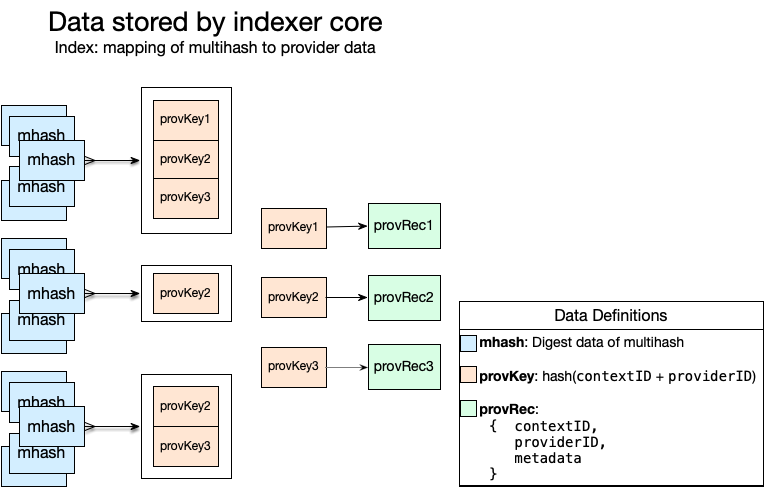

# Data Storage

Many multihashes map to relatively few provider records. A multihash is used to lookup the provider records describing where that multihash is available. A provider ID and context ID are used to lookup a unique provider record.

Provider data can be updated and removed independently from the multihashes that map to it. Provider data is uniquely identified by a provider ID and a context ID. The context ID is given to the indexer core as part of the provider data value. When a provider data object is updated, all subsequent multihash queries will return the new value for that data whether the queries are cached or not.

Unique provider records are looked up by a provider key, which is a hash of the provider ID and the record's context ID. A multihash can map to multiple provider records, since the same content may be stored by different provider and be part of separate deals at the same provider. To provider this functionality, the indexer core maps each multihash to a list of provider keys, and maps each provider key to a provider record.

